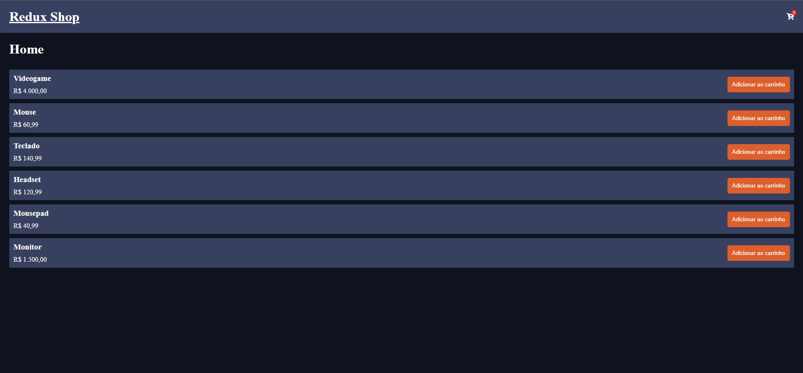

# Projeto de loja com Redux

Este projeto foi criado com a ideia de aprender o básico da biblioteca Redux, integrada com React. Para isso, foi criado uma loja que funciona com carrinho, em que o número de itens é atualizado instantaneamente e é possível adicionar e remover itens manualmente

## Preview



## Configuração

1. **Clonando o repositório:**
   ```
   git clone https://github.com/Vinicius-b-oliveira/Redux-Shop.git
   ```
2. **Instalando dependências:**
   ```
   npm install
   ```
   Este comando instalará todas as dependências necessárias para o projeto.

3. **Iniciando no navegador:**
   ```
   npm start
   ```
   Este comando criará um servidor local para o projeto.

## Como Usar

Basta utilizar os botões e se divertir navegando pela página, clique no carrinho para acessá-lo e no titulo "Redux Shop" para voltar à Home. 🚀
